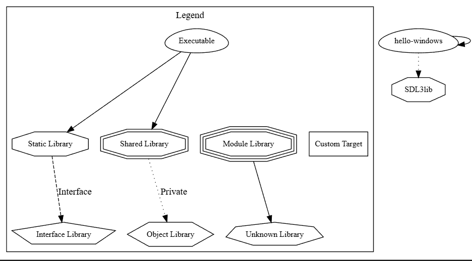

# Getting Started
```bash
# clone this repository
 git clone https://github.com/hlimbo/learning-sdl3.git
# clone the `vendored/SDL` directory containing the SDL3 source code dependency
git submodule update --init --recursive
```

## CMake 3.16 - Mac

### Prereqs
1. Install XCode and verify that the cmake command below uses clang as its compiler by running the `Configure CMake` command below (It should be the first 2 lines when it starts the configuration process)

Example Output:
```
-- The C compiler identification is AppleClang 17.0.0.17000013
-- The CXX compiler identification is AppleClang 17.0.0.17000013
```

### Build SDL3 from source - Mac
**Note** Run these commands starting from the `learning-sdl3` folder as the root directory

1. Configure CMake
```bash
cmake -S . -B platform_builds/mac
```

2. Build CMake Project
```bash
cmake --build platform_builds/mac
```

3. If the build is good, you should see the app in:
```
platform_builds/mac/hello-mac.app
```

Can run the project by opening the `build` folder in Finder and double clicking on `hello-mac` to open the hello world program

### Build SDL3 from source - Windows
1. Configure CMake
```bash
cmake -S . -B platform_builds/windows
```

2. Build CMake Project
```bash
# debug builds
cmake --build platform_builds/windows --config Debug
# release builds
cmake --build platform_builds/windows --config Release
```

3. If build succeeded, hello world app should be located in:
```
platform_builds/windows/Debug/hello-windows.exe
```

4. To package up in a easy to distribute fashion. CMake can transfer what was built using Step 2 into `./dist/debug` and `./debug/release` folders respectively in the root directory of this project. The commands for each one are as follows:
```bash
# debug - creates a dist/debug folder containing the game's .exe
cmake --install platform_builds/windows --prefix "./dist/debug" --config Debug

# release - creates a dist/release folder containing the game's .exe
cmake --install platform_builds/windows --prefix "./dist/release" --config Release
```

## Debugging
### How to view CMake Dependency graph visually?
```bash
cmake -S . -B platform_builds/windows --graphviz=dist/dep_visualization/graph.dot
```
Related Documentation: https://cmake.org/cmake/help/latest/manual/cmake.1.html#cmdoption-cmake-graphviz

To visualize the graph: install the following visual studio extension:
```
https://marketplace.visualstudio.com/items?itemName=ijmacd.graphviz-previewer-web
```
* To open preview, open the `.dot` file generated in the `dist/dep_visualization` folder and open the command palette and search for `Graphviz: Preview Dot File (Side)`

This should be useful in visualizing dependencies as the project gets bigger

Example files output will be generated in the `dist/dep_visualization` 
folder


```bash
# this is the main dependency graph
graph.dot
# 
graph.dot.*.dependers
```

### Example Graph



## Commands to run when in the `vendored/SDL` directory on command line

### Build `vendored/SDL` folder with Examples on
```bash
cd vendored/SDL
cmake -S . -B build -D SDL_EXAMPLES=ON
cmake --build build
```

* If build is good:
  * you should see the examples built in the `vendored/SDL/build/examples` folder listed below
  * you should be able to obtain the `SDL3.dll` and `SDL3.lib` files in `vendored/SDL/build/Debug` on *Windows*

#### Windows Executables Location
```bash
# applications should end in .exe
vendored/SDL/build/examples/Debug
```

#### Windows SDL3.dll file
**Note** this file should be in the same folder as your executable. Otherwise, you will see an error and the game won't start.
```
vendored/SDL/build/debug/SDL3.dll
```

#### Mac Executables Location
```bash
# applications should end in .app
vendored/SDL/build/examples
```

### Misc

To view list of all CMAKE variables
```
cmake --help-variable-list
```